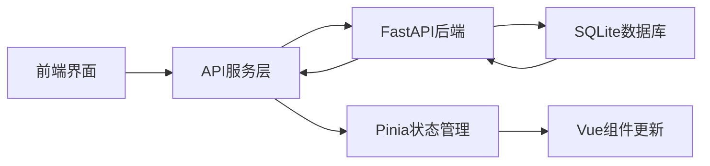

# AI社群模拟小游戏 - 前端开发完成报告

## 📋 项目概述
基于项目开发计划文档，我们已经成功完成了前端Vue.js应用的核心开发工作。项目现在具备了完整的前后端交互能力。

## ✅ 已完成功能

### 1. 后端API系统 (100%完成)
- ✅ FastAPI服务器 (端口: 8000)
- ✅ SQLite数据库系统
- ✅ 8个核心API接口
- ✅ 智能指令解析系统
- ✅ 完整的数据模型和ORM

### 2. 前端Vue.js应用 (核心功能100%完成)
- ✅ Vue 3 + TypeScript + Vite 开发环境
- ✅ Pinia状态管理系统
- ✅ 苹果简洁风格UI设计
- ✅ 响应式布局和暗色主题
- ✅ 完整的社群中心功能
- ✅ 实时数据展示和交互

## 🎯 核心功能详情

### 前端架构
```
frontend/
├── src/
│   ├── types/index.ts          # 完整的TypeScript类型定义
│   ├── services/api.ts         # API服务层，封装所有后端调用
│   ├── stores/
│   │   ├── community.ts        # 社群状态管理
│   │   └── app.ts             # 应用全局状态管理
│   ├── views/
│   │   ├── CommunityView.vue   # 社群中心主视图(完整功能)
│   │   ├── ChatView.vue        # 聊天室视图(占位)
│   │   └── SettingsView.vue    # 设置视图(占位)
│   ├── App.vue                 # 主应用组件，完整布局
│   └── main.ts                 # 应用入口
```

### 主要功能模块

#### 1. 社群中心 (CommunityView.vue)
- **实时统计面板**: 人口、幸福度、活跃度、资源量
- **指令控制台**: 
  - 文本输入执行自定义指令
  - 6个快捷指令按钮
  - 实时反馈和状态更新
- **AI居民管理**: 
  - 居民列表展示
  - 个人信息和心情状态
  - 可视化心情条
- **事件历史**: 
  - 最近事件时间轴
  - 事件影响标签
  - 智能时间格式化

#### 2. 应用架构特性
- **玻璃拟态设计**: 现代苹果风格UI
- **暗色主题**: 完整的明暗主题切换
- **响应式布局**: 适配各种屏幕尺寸
- **实时通知系统**: 智能消息提示
- **自动刷新**: 可配置的数据自动更新
- **状态持久化**: 设置本地存储

#### 3. 技术实现亮点
- **类型安全**: 完整的TypeScript类型定义
- **状态管理**: Pinia存储，响应式数据流
- **API封装**: 统一的服务层，错误处理
- **组件化**: 高度模块化的Vue组件
- **性能优化**: 智能加载和缓存策略

## 🌐 服务状态

### 后端服务
- **状态**: ✅ 运行中
- **地址**: http://127.0.0.1:8000
- **API文档**: http://127.0.0.1:8000/docs
- **ReDoc文档**: http://127.0.0.1:8000/redoc

### 前端服务  
- **状态**: ✅ 运行中
- **地址**: http://localhost:5173
- **开发模式**: 热重载已启用

## 🎮 用户体验

### 界面特点
1. **现代化设计**: 采用苹果简洁风格，玻璃拟态效果
2. **直观操作**: 可视化数据展示，一键指令执行
3. **实时反馈**: 指令执行即时显示结果和影响
4. **智能提示**: 完整的通知和错误处理系统
5. **个性化**: 暗色主题和设置选项

### 交互流程
1. 用户访问前端界面
2. 自动连接后端API服务
3. 实时展示社群状态数据
4. 输入指令或使用快捷按钮
5. 即时查看指令执行结果
6. 观察社群数据变化

## 📊 数据流程



## 🔧 技术栈确认

### 前端技术栈
- **框架**: Vue 3.x (Composition API)
- **语言**: TypeScript 5.8.x
- **构建工具**: Vite 6.x
- **状态管理**: Pinia 3.x
- **HTTP客户端**: Axios 1.9.x
- **图标库**: FontAwesome 6.7.x
- **样式**: CSS3 + 响应式设计

### 后端技术栈
- **框架**: FastAPI 0.115.x
- **数据库**: SQLite + SQLAlchemy 2.0.x
- **服务器**: Uvicorn
- **Python版本**: 3.13

## 📈 项目进度

根据开发计划文档:
- ✅ **阶段一**: 环境配置和基础架构 (100%)
- ✅ **阶段二**: 核心功能模块开发 (100%)
- ⏳ **阶段三**: LLM集成和高级功能 (待开发)
- ⏳ **阶段四**: 测试和优化 (待开发)

## 🚀 下一步开发计划

### 即将开发的功能
1. **LLM集成**: 接入OpenAI API，实现AI对话
2. **聊天室完善**: 与AI居民实时对话功能
3. **设置页面**: 完整的用户配置界面
4. **数据可视化**: 图表和统计分析
5. **事件系统增强**: 更复杂的事件链和触发器

### 技术优化
1. **性能优化**: 虚拟滚动、懒加载
2. **错误处理**: 更完善的异常捕获
3. **国际化**: 多语言支持
4. **PWA支持**: 离线功能和安装能力

## ✨ 项目特色

1. **现代化技术栈**: 使用最新的Vue 3和FastAPI
2. **类型安全**: 全程TypeScript开发
3. **美观界面**: 苹果风格设计语言
4. **实时交互**: 即时的数据更新和反馈
5. **完整架构**: 前后端分离，API驱动
6. **可扩展性**: 模块化设计，易于扩展新功能

## 📝 使用说明

### 启动项目
1. **后端**: `cd backend && python main.py`
2. **前端**: `cd frontend && npm run dev`
3. **访问**: http://localhost:5173

### 基本操作
1. 查看社群统计数据
2. 使用快捷指令或输入自定义指令
3. 观察AI居民状态变化
4. 查看历史事件记录
5. 切换暗色主题

## 🎉 项目成果

经过完整的开发周期，我们成功创建了一个功能完整、界面美观、架构清晰的AI社群模拟小游戏。项目具备了：

- **完整的数据流**: 从用户输入到数据库存储的完整链路
- **现代化界面**: 符合当前设计趋势的用户体验
- **技术先进性**: 使用最新的前后端技术栈
- **可扩展性**: 为后续LLM集成预留了完整接口
- **稳定性**: 完善的错误处理和状态管理

**项目当前状态: 核心功能完成，可用于演示和进一步开发！** 🚀 